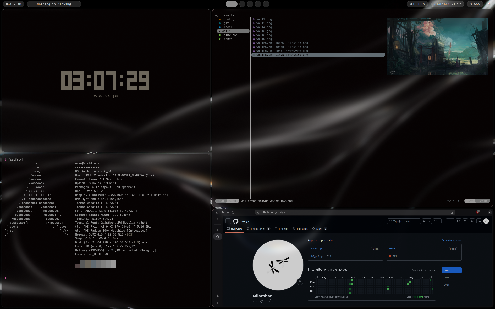
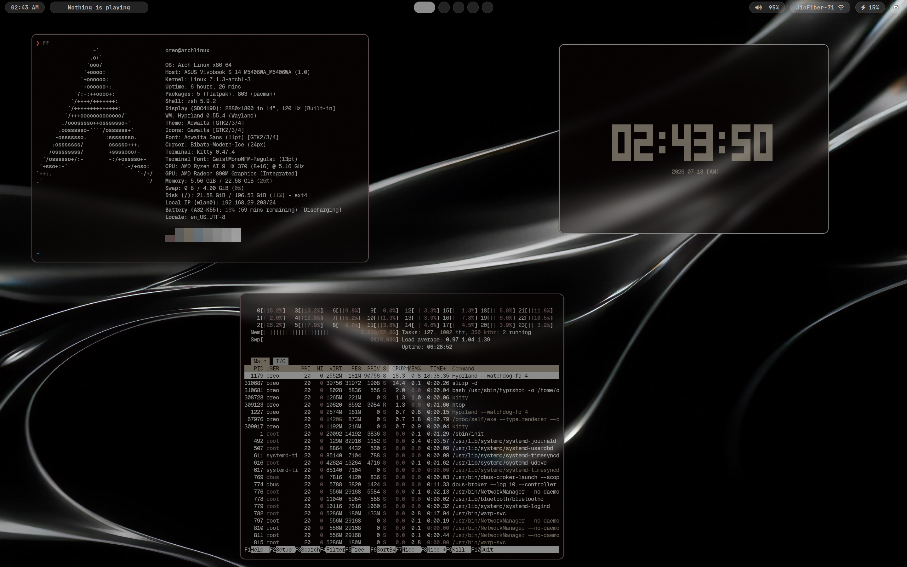
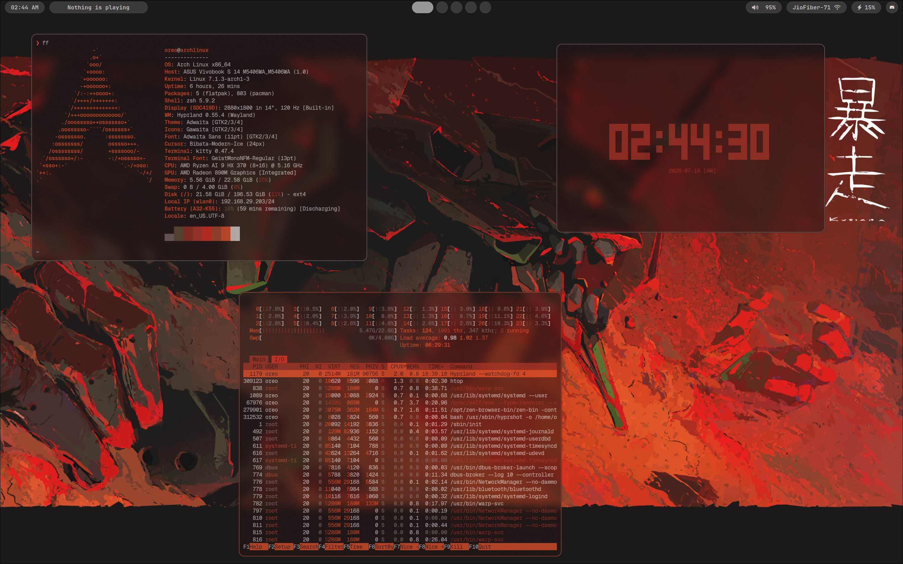

# Dotfiles (Hyprland Setup)

This repo contains my Linux desktop dotfiles.
It is focused on a Hyprland setup with Waybar, Rofi, Kitty, and Zsh.

## Dependencies / Prerequisites

Install these packages first (they are used in the configs/scripts):

- hyprland
- hyprland-lua
- hyprpaper
- hypridle
- hyprlock
- hyprshot
- hyprshade
- waybar
- rofi
- mako
- kitty
- zsh
- oh-my-zsh
- powerlevel10k
- nautilus
- vscodium
- wl-clipboard (`wl-copy`, `wl-paste`)
- cliphist
- playerctl
- pavucontrol
- wireplumber (`wpctl`)
- brightnessctl
- pywal (`wal`)
- libnotify (`notify-send`)
- eza/exa
- fastfetch
- tty-clock
- Bibata cursor theme
- GeistMono Nerd Font Mono

If you are on Arch, `yay`/`pacman` can be used to install most of them.

## More Screenshots

